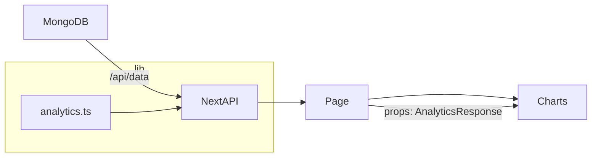

# Advanced Analytics Dashboard (Next.js 14)

## Overview & Purpose
This project reimagines the legacy HTML + Node analytics dashboard as a fully typed Next.js 14 application. Calculations now live in a single pure module (`lib/analytics.ts`) while every visualisation sits inside a dedicated client-only chart bundle (`components/Charts.tsx`). The result is a modern, server-rendered experience with Tailwind styling, Mongo-backed analytics, and highly reusable exports for other teams.

## Architecture & File Layout
```
/app
  layout.tsx            # Root layout wiring global styles
  page.tsx              # Server component – fetches analytics & composes sections
  /api/data/route.ts    # GET endpoint that returns the AnalyticsResponse payload
/components
  Charts.tsx            # 'use client' – all chart/table React components
/lib
  analytics.ts          # Pure analytics models, Mongo orchestration, typed contract
/styles
  globals.css           # Tailwind base layer and card helpers
next.config.js
package.json
postcss.config.js
tailwind.config.js
tsconfig.json
```
- **`lib/analytics.ts`** stays free of UI and only exports typed functions. Helper routines calculate every metric (Markov chains, co-occurrence, anomaly scanning) before emitting a single `AnalyticsResponse` structure.
- **`components/Charts.tsx`** is intentionally the lone client module. All Nivo charts, tables, and interactions are colocated to avoid sprinkling `"use client"` across the tree and to simplify downstream reuse.

## Data Flow


## API Contract
```ts
export type AnalyticsResponse = {
  sessions: Array<{ sessionId: string; visitorId: string; country: string; ts: string; nView: number; nCartAdd: number; nCartRemove: number }>;
  leak: { overall: number; items: Array<{ item: string; adds: number; removes: number; leak: number }> };
  recos: Record<string, Array<{ item: string; score: number }>>;
  frequentBundles: Array<{ items: [string, string]; support: number }>;
  priceMarkov: Record<'Low' | 'Mid' | 'High' | 'All', { pViewToCart: number; pCartToCheckout: number }>;
  priceMarkovMeta: { tLow: number | null; tHigh: number | null; min: number; max: number };
  priceBands: { bands: Array<{ name: 'Low' | 'Mid' | 'High' | 'All'; min: number; max: number; viewToCart: number; wishToCart: number; nView: number; nWish: number }> };
  priceRangeData: { viewFromPrices: number[]; viewToCartFromPrices: number[]; cartAddPrices: number[]; cartRemovePrices: number[] };
  categoryInteractions: Array<{ category: string; views: number; carts: number; wish: number; total: number }>;
  transitions: { states: string[]; counts: number[][]; probs: number[][] };
  sankey: { nodes: string[]; links: Array<{ source: number; target: number; value: number }> };
  daily: { series: Array<{ date: string; views: number; carts: number }>; anomaly: { hasThresholds: boolean; lower: number; upper: number; outliers: string[] } };
  geoInsights: Array<{ country: string; conversionRate: number }>;
  itemMeta: Record<string, { title: string; price: number; category: string; brand: string }>;
  __version: string;
};
```

**Example response (truncated):**
```json
{
  "sessions": [{
    "sessionId": "64f...",
    "visitorId": "anon-123",
    "country": "GB",
    "ts": "2024-10-12T10:22:30.101Z",
    "nView": 12,
    "nCartAdd": 2,
    "nCartRemove": 0
  }],
  "leak": { "overall": 0.18, "items": [{ "item": "Audio", "adds": 54, "removes": 7, "leak": 0.13 }] },
  "priceMarkov": { "Low": { "pViewToCart": 0.21, "pCartToCheckout": 0.74 }, "All": { "pViewToCart": 0.18, "pCartToCheckout": 0.71 } },
  "priceBands": { "bands": [{ "name": "Low", "min": 4.99, "max": 29.5, "viewToCart": 0.2, "wishToCart": 0.09, "nView": 440, "nWish": 120 }] },
  "daily": { "series": [{ "date": "2024-10-01", "views": 140, "carts": 22 }], "anomaly": { "hasThresholds": true, "lower": 8.2, "upper": 35.6, "outliers": [] } },
  "__version": "v2025-10-02b: price-range+catmap+reset-month (Next.js)"
}
```

## Export Surface
- From **`lib/analytics.ts`**:
  ```ts
  export async function computeAnalyticsFromMongo(db: Db): Promise<AnalyticsResponse>
  ```
- From **`components/Charts.tsx`**:
  ```ts
  export {
    PurchaseFunnelByPrice,
    TransitionHeatmap,
    SankeyFlow,
    PriceBandsChart,
    DailyTrends,
    CartLeakByCategory,
    MostInteractedCategories,
    ItemRecommender
  };
  ```

**Usage snippets**
```ts
import { computeAnalyticsFromMongo } from '@/lib/analytics';
import { DailyTrends, MostInteractedCategories } from '@/components/Charts';

const analytics = await computeAnalyticsFromMongo(db);

<DailyTrends data={analytics} />
<MostInteractedCategories data={analytics} />
```

## How the Calculations Work
- **Category mapping & metadata** – `buildCategoryMap` resolves `productcategories` ObjectIds, merges with listing info, and surfaces title/price/brand/category per item.
- **Price-tier Markov** – `priceSegmentedMarkov` winsorises prices (5–95%), applies log-quantiles (d3-array) to split Low/Mid/High, and tracks view→cart and cart→checkout proxies per tier.
- **Custom price ranges** – `buildPriceRangeData` stores raw price vectors (views, view→cart transitions, cart adds/removes) enabling on-the-fly funnel calculations in the UI.
- **Price bands** – `priceBandsFromQuantiles` reuses quantiles to compute smoothed conversions (Laplace prior) along with sample sizes for tooltip context.
- **Transition matrix & Sankey** – `transitionMatrixAndSankey` sequences events per session, counts next-step transitions, and emits both probability and flow data for heatmap + Sankey.
- **Daily trends & anomaly scan** – `dailyTrends` aggregates counts per ISO day then flags outliers using ±2σ around the mean (d3-array mean/deviation).
- **Cart leak by category** – `leakAnalytics` aggregates adds/removes at the mapped category level and reports leak ratios plus overall loss.
- **Category interactions** – `categoryInteractions` tallies views, wishlist adds, and cart adds per category for the stacked bar/table view.
- **Co-occurrence recommendations** – `cooccurrenceRecos` computes cosine-normalised support across session item sets for both bundle suggestions and recos.
- **Libraries** – Quantile/mean/deviation/clamp are from `d3-array`; date bucketing/reset logic uses `date-fns`.

## How the Charts Work
- **PurchaseFunnelByPrice** – Controlled tier dropdown plus custom price range fields using raw `priceRangeData`. Displays tier funnel percentages and recalculates the custom range view→cart and cart→checkout proxy, including sample sizes.
- **TransitionHeatmap** – `@nivo/heatmap` renders next-step probabilities. Below the chart, generated sentences follow the required narrative format, appending an "other things or stop" share computed as `100 - Σ(top events)`.
- **SankeyFlow** – `@nivo/sankey` visualises flows; links below 2 % of the max flow are pruned to reduce noise, and hover states highlight paths.
- **PriceBandsChart** – `@nivo/bar` grouped bars show view→cart% and wishlist→cart%. Tooltips include the n-samples for context and the section is 40 % taller for readability.
- **DailyTrends** – `@nivo/line` with date filters and a `Reset` button. Reset snaps to the current calendar month via `date-fns`, with a fallback to the full series when the month lacks data.
- **CartLeakByCategory** – Tailwind table sorted by leak ratio, showing adds/removes and leak%. Categories come directly from `productcategories.name`.
- **MostInteractedCategories** – Stacked bar (views/wishlist/cart) plus a sortable table listing totals in descending order.
- **ItemRecommender** – Dropdown selects an anchor SKU and the table lists recommended items with scores, categories, and prices (£).

Each component accepts `data: AnalyticsResponse` and expects the caller to provide Tailwind styling (global import handled in `layout.tsx`).

## Setup & Running
```bash
pnpm install   # or npm install

# Required environment variables
echo "MONGO_URI=mongodb://127.0.0.1:27017" >> .env.local
# Optional overrides (defaults shown):
# DB_NAME=BMR
# LISTINGS_COLLECTION=listing
# TRACKING_COLLECTION=customer_tracking_synthetic
# PRODUCT_CATEGORIES_COLLECTION=productcategories

pnpm dev       # or npm run dev
```
Visit `http://localhost:3000` to see the dashboard once the API can reach Mongo.

## Integrating into Another Project
**Option A – Embed the whole app**: copy this repository into your monorepo (e.g. under `/apps/analytics-dashboard`) and wire routes per standard Next.js conventions.

**Option B – Reuse the exports**:
1. Copy `lib/analytics.ts` and `components/Charts.tsx` (plus their peer dependencies) into your project.
2. Install peer libraries: `@nivo/heatmap @nivo/sankey @nivo/bar @nivo/line d3-array date-fns tailwindcss mongodb`.
3. Import `computeAnalyticsFromMongo` inside your API route or server utility and call it with a Mongo `Db` instance.
4. Fetch the resulting `AnalyticsResponse` in a server component, then render any chart in a client boundary:
   ```tsx
   import { MostInteractedCategories } from '@/components/Charts';
   // ... inside a client component:
   <MostInteractedCategories data={analytics} />
   ```
5. Because charts are client-only, wrap them in a client component or dynamically import with `ssr: false` when embedding into SSR pages.

## Troubleshooting & FAQ
- **Empty charts** – Ensure Mongo collections contain sessions, listings, and category data. Empty arrays are returned gracefully but visuals stay blank.
- **Timezone/date gaps** – All dates are normalised to ISO (UTC) strings. If you ingest local timestamps, convert to ISO before storing to avoid bucket splits.
- **Styling clashes** – Tailwind is scoped via `globals.css`. If integrating elsewhere, merge the theme or rename the card utility classes.
- **Performance tips** – Nivo charts accept memoised data arrays; heavy datasets may benefit from server-side aggregation or reduced payload sizes. The Sankey already prunes flows below 2 % of the maximum link weight.

## Performance & Testing
- Computations memoise repeated quantile calculations and reuse precalculated price arrays for UI recalculations.
- For very large datasets, consider adjusting Mongo `limit()` values or adding indexes on session timestamps.
- Use Next.js built-in testing (`next lint`, component tests) plus representative seed data to validate chart rendering.
